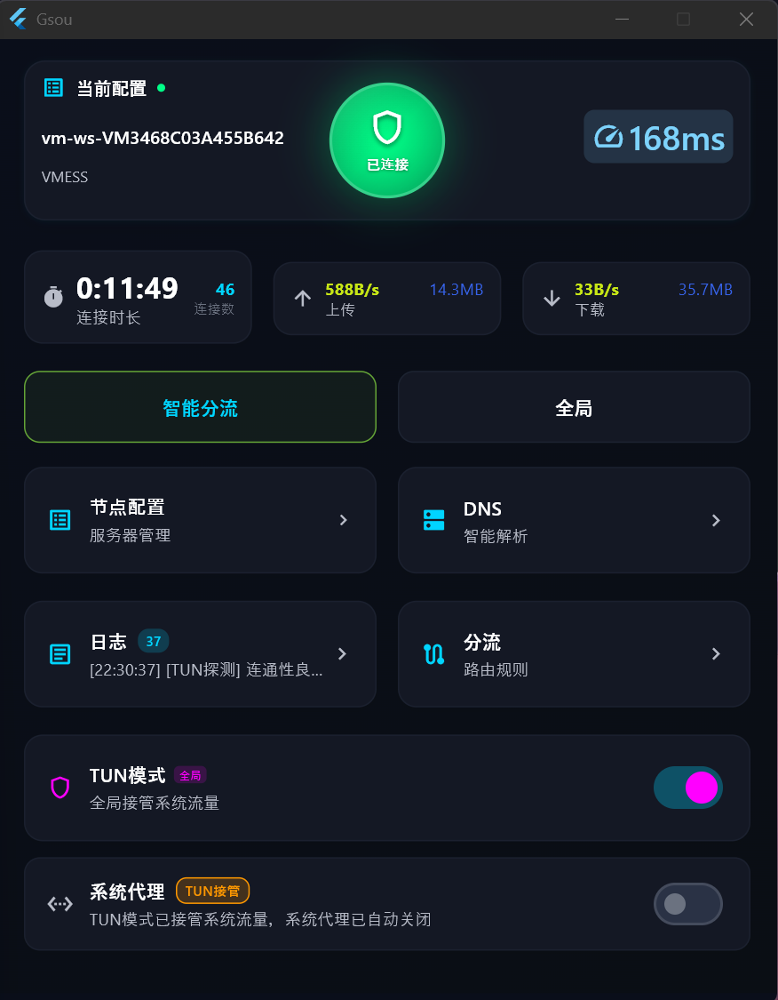

# Gsou - Sing-box VPN 客户端

### 一个免费，没广告的代理客户端 - windows 
###### 无需安装(运行需要管员权限，为了使用TUN模式)，不需要设置，打开设置好服务节点就能使用
-    支持ymal节点配置文件导入
-    支持机场远程订阅链接导入
-    支持二维码的扫描导入节点
-    代理协议：Shadowsocks/ShadowTLS/VLESS/AnyTLS/Hysteria2/TUIC/VMess/Trojan
-    支持路由规则设置
-    支持使用两个节点分流（可显示是否在用），比如：节点A 代理 YouTube 视频流量，节点B 代理上网流量）

### 最小化窗口后显示悬浮上传下载速度


### 主界面



一个基于 Flutter 开发的 sing-box  客户端，仅支持 Windows 平台。

## 项目简介
Gsou 是一个简单的客户端应用，基于 sing-box 核心构建。

### 主要特性

- **现代化 UI**: 基于 Flutter 构建，支持 Windows 平台
- **系统托盘支持**: 后台运行，系统托盘快速访问
- **多协议支持**: 支持多种代理协议和配置格式
- **灵活配置**: 支持导入配置文件和二维码扫描
- **高性能**: 基于 sing-box 核心

## 系统要求

- **操作系统**: Windows 10 或更高版本
- **Flutter SDK**: >=3.9.2
- **开发工具**: Visual Studio Code / IntelliJ IDEA

## 两个节点分流使用说明（只有选择：规则 才会生效， 全局不会生效）

下面用最直白的方式告诉你，如何用两个节点来分流：比如“看视频走节点A，上网聊天走节点B”。

### 一句话原理

- 应用内部会同时准备 3 个“出站口”：默认代理 `proxy`、代理A `proxy-a`、代理B `proxy-b`。
- 你把节点 X 绑定到“代理A”，把节点 Y 绑定到“代理B”，再在“分流规则”里决定哪些网站/应用走 A 或 B。
- 没有命中任何分流规则的流量，最终会走“最终出站”(route.final)，也可以在绑定页面里改成 A 或 B。

### 一次性设置 3 步

#### 步骤 1：绑定两个节点

- 打开“分流”→“出站绑定”标签页。
- 代理A：从下拉框里选一个你想专门给视频或大流量用的节点。
- 代理B：从下拉框里选另一个日常上网的节点。
- 最终出站：不想写规则时，可以临时把所有流量都走 A 或 B；一般保持“proxy(默认)”即可。

#### 步骤 2：写分流规则（可选，但强烈推荐）

- 打开“分流”→“规则管理”。
- 新建规则示例：
  - 规则1：geosite = youtube、netflix、bilibili 等，出站选“代理A”。
  - 规则2：geosite = cn 或常用国内站点，出站选“直连”。
  - 规则3：其他国际网站（如 geosite:geolocation-!cn），出站选“代理B”。
- 提示：如果你的规则和“境外代理(600)”存在优先级竞争，把新建规则的“优先级”设成 650 以上更稳妥。

#### 步骤 3：选择节点页看到“是否在用”

- 打开“选择节点”页面，你绑定为“代理A/代理B”的节点会被“点亮”并显示徽标，表示“已被分流使用”。
- 只有当某类流量真的命中到该出站时，它才会真正连上建立隧道，所以刚开始不一定会同时显示“已连接”，这是正常的。

### 常见使用场景示例

- 场景A：看视频走更快的节点A，上网走更稳的节点B
  - 绑定：A=日本 1，B=香港 2。
  - 规则：YouTube/Netflix→代理A；国外其他→代理B；国内→直连。
- 场景B：只想让特定网站走节点A，其他全走节点B
  - 规则：把少数网站放到“代理A”，其余默认“最终出站”设为“代理B”。
- 场景C：临时全部走 A 或全部走 B
  - 在“出站绑定”里把“最终出站”改成 A 或 B，省去写规则。

### 如何验证分流是否生效

- 在“选择节点”页：
  - 被绑定为“代理A/代理B”的节点会高亮显示，表示它处于“可用/被分流指派”的状态。
  - 当你打开对应网站（如 youtube.com）产生流量后，目标节点的状态可能会显示“已连接”。
- 在“日志”页面：
  - 可查看路由命中记录与连接日志，确认哪些域名走了 A、哪些走了 B。
- 在“悬浮速度”或“连接状态”里：
  - 观察上传/下载速度变化，判断哪个出站正在承载流量。

### 小贴士

- 没有绑定的 A 或 B：如果规则写成“出站=代理A”，但 A 未绑定节点，系统会自动回退到默认代理 `proxy`，避免断流。
- 何时会“同时连接两个节点”？只有当两个出站都有被命中的流量时才会连接，否则不会空转浪费资源。
- 规则顺序与优先级很重要：优先级数值越大越靠前，建议自定义规则 ≥ 650，以覆盖内置“境外代理(600)”。
- 不确定就先少写几条规则，观察生效情况，再逐步补充。
 
### 状态管理与存储

- `provider`: ^6.1.2 - 状态管理
- `shared_preferences`: ^2.3.3 - 本地存储

### 文件与网络

- `file_picker`: ^8.1.4 - 文件选择
- `http`: ^1.2.2 - HTTP 请求
- `json_annotation`: ^4.9.0 - JSON 序列化

### 系统集成

- `process_run`: ^1.2.0 - 进程管理
- `path_provider`: ^2.1.5 - 路径处理
- `path`: ^1.9.0 - 路径工具

### 图像处理

- `image`: ^4.2.0 - 图像处理
- `zxing2`: ^0.2.4 - 二维码解析

### 系统 API

- `ffi`: ^2.1.0 - FFI 支持
- `win32`: ^5.5.4 - Windows API 与注册表
- `yaml`: ^3.1.2 - YAML 解析

## 安装与使用

1,  可从发布处下载已以布的版本使用
2， git 本仓库的源码进行进行编译使用


### 开发环境搭建

1. **安装开发环境**

```bash
# 确保 Flutter SDK 版本 >=3.9.2
flutter --version
# go 版本 = go1.23.1 windows/amd64
go version
# msys64
gcc = x86_64-w64-mingw32
```

1. **克隆项目**

```bash
git clone https://github.com/josonxie581/sing_box_vpn.git
cd sing_box_vpn
```


1. **安装依赖**

```bash
flutter pub get
```

1. **编译运行**

```bash
# 调试模式运行
flutter run -d windows

# 发布版本编译
flutter build windows --release
./publish.ps1
```

### 编译 sing-box DLL

项目支持使用本地 sing-tun 源码编译 sing-box DLL：

1. **自动编译**（推荐）

```powershell
# 完整编译
.\build_all.ps1

# 仅编译 DLL（跳过 Flutter）
.\build_all.ps1 -SkipFlutter
```

1. **使用 Dart 脚本**

```bash
dart run tools/prebuild.dart --force
```

详细说明请参考：[LOCAL_SING_TUN_USAGE.md](LOCAL_SING_TUN_USAGE.md)

## 项目结构

```text
sing_box_vpn/
├── lib/                    # Flutter 应用源码
│   ├── main.dart          # 应用入口
│   ├── models/            # 数据模型
│   ├── providers/         # 状态管理
│   ├── screens/           # 页面组件
│   ├── services/          # 服务层
│   ├── theme/             # 主题配置
│   ├── utils/             # 工具函数
│   └── widgets/           # UI 组件
├── assets/                # 资源文件
├── native/                # Go native 代码
├── tools/                 # 构建工具
├── windows/               # Windows 平台特定代码
├── build_all.ps1         # PowerShell 构建脚本
└── pubspec.yaml          # 项目配置文件
```

## 开发指南

### 代码规范

- 遵循 Flutter 官方代码规范
- 使用 `flutter_lints` 进行代码检查
- 保持代码整洁和良好的注释

### 构建流程

1. **预构建**: 处理 native 代码和依赖
2. **资源处理**: 处理图片、字体等资源文件
3. **编译**: Flutter 应用编译
4. **打包**: 生成可执行文件

### 调试技巧

- 使用 `flutter logs` 查看运行日志
- 使用 `flutter inspector` 调试 UI
- 查看 `gsou_daemon.log` 了解后台服务状态

## 贡献指南

欢迎提交 Issue 和 Pull Request 来帮助改进项目。

## 许可证

本项目遵循相应的开源许可证，具体请查看项目中的许可证文件。

## 支持

如果您在使用过程中遇到问题，请：

1. 查看项目文档和常见问题
2. 搜索已有的 Issue
3. 创建新的 Issue 描述问题

---

**注意**: 本项目(所有代码开源仅供学习交流使用)，请遵守当地法律法规。
