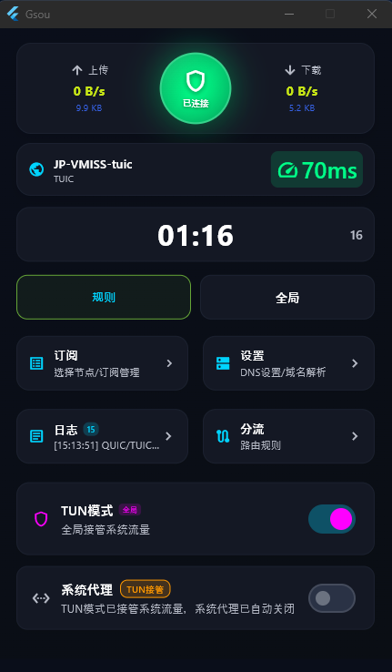

# Gsou - Sing-box VPN 客户端

### 一个免费，没广告的代理客户端 - windows 
###### 无需安装(运行需要管员权限，为了使用TUN模式)，不需要设置，打开设置好服务节点就能使用
-    支持ymal节点配置文件导入
-    支持机场远程订阅链接导入
-    支持二维码的扫描导入节点
-    代理协议：Shadowsocks/ShadowTLS/VLESS/AnyTLS/Hysteria2/TUIC/VMess/Trojan
-    支持路由规则设置

### 最小化窗口后显示悬浮上传下载速度


### 主界面



一个基于 Flutter 开发的 sing-box  客户端，仅支持 Windows 平台。

## 项目简介
开发初衷：一个晚上为了能用上AI，配置代理的协议竟然用了两个小时，所以造了一个配置简单点客户端。
Gsou 是一个简单的客户端应用，基于 sing-box 核心构建。

### 主要特性

- **现代化 UI**: 基于 Flutter 构建，支持 Windows 平台
- **系统托盘支持**: 后台运行，系统托盘快速访问
- **多协议支持**: 支持多种代理协议和配置格式
- **灵活配置**: 支持导入配置文件和二维码扫描
- **高性能**: 基于 sing-box 核心

## 系统要求

- **操作系统**: Windows 10 或更高版本
- **Flutter SDK**: >=3.9.2
- **开发工具**: Visual Studio Code / IntelliJ IDEA

## 主要依赖

### 核心依赖
- `flutter`: Flutter SDK
- `cupertino_icons`: ^1.0.8 - iOS 风格图标

### UI 与窗口管理
- `system_tray`: ^2.0.3 - 系统托盘支持
- `window_manager`: ^0.4.3 - 窗口管理
- `flutter_acrylic`: ^1.1.3 - 窗口特效与透明度

### 状态管理与存储
- `provider`: ^6.1.2 - 状态管理
- `shared_preferences`: ^2.3.3 - 本地存储

### 文件与网络
- `file_picker`: ^8.1.4 - 文件选择
- `http`: ^1.2.2 - HTTP 请求
- `json_annotation`: ^4.9.0 - JSON 序列化

### 系统集成
- `process_run`: ^1.2.0 - 进程管理
- `path_provider`: ^2.1.5 - 路径处理
- `path`: ^1.9.0 - 路径工具

### 图像处理
- `image`: ^4.2.0 - 图像处理
- `zxing2`: ^0.2.4 - 二维码解析

### 系统 API
- `ffi`: ^2.1.0 - FFI 支持
- `win32`: ^5.5.4 - Windows API 与注册表
- `yaml`: ^3.1.2 - YAML 解析

## 安装与使用

1,  可从发布处下载已以布的版本使用
2， git 本仓库的源码进行进行编译使用

### 开发环境搭建

1. **安装开发环境**
   ```bash
   # 确保 Flutter SDK 版本 >=3.9.2
   flutter --version
   # go 版本 = go1.23.1 windows/amd64
   go version
   # msys64
   gcc = x86_64-w64-mingw32
   ```

2. **克隆项目**
   ```bash
   git clone https://github.com/josonxie581/sing_box_vpn.git
   cd sing_box_vpn
   ```

3. **安装依赖**
   ```bash
   flutter pub get
   ```

4. **编译运行**
   ```bash
   # 调试模式运行
   flutter run -d windows

   # 发布版本编译
   flutter build windows --release
   ./publish.ps1
   ```

### 编译 sing-box DLL

项目支持使用本地 sing-tun 源码编译 sing-box DLL：

1. **自动编译**（推荐）
   ```powershell
   # 完整编译
   .\build_all.ps1

   # 仅编译 DLL（跳过 Flutter）
   .\build_all.ps1 -SkipFlutter
   ```

2. **使用 Dart 脚本**
   ```bash
   dart run tools/prebuild.dart --force
   ```

详细说明请参考：[LOCAL_SING_TUN_USAGE.md](LOCAL_SING_TUN_USAGE.md)

## 项目结构

```
sing_box_vpn/
├── lib/                    # Flutter 应用源码
│   ├── main.dart          # 应用入口
│   ├── models/            # 数据模型
│   ├── providers/         # 状态管理
│   ├── screens/           # 页面组件
│   ├── services/          # 服务层
│   ├── theme/             # 主题配置
│   ├── utils/             # 工具函数
│   └── widgets/           # UI 组件
├── assets/                # 资源文件
├── native/                # Go native 代码
├── tools/                 # 构建工具
├── windows/               # Windows 平台特定代码
├── build_all.ps1         # PowerShell 构建脚本
└── pubspec.yaml          # 项目配置文件
```

## 开发指南

### 代码规范
- 遵循 Flutter 官方代码规范
- 使用 `flutter_lints` 进行代码检查
- 保持代码整洁和良好的注释

### 构建流程
1. **预构建**: 处理 native 代码和依赖
2. **资源处理**: 处理图片、字体等资源文件
3. **编译**: Flutter 应用编译
4. **打包**: 生成可执行文件

### 调试技巧
- 使用 `flutter logs` 查看运行日志
- 使用 `flutter inspector` 调试 UI
- 查看 `gsou_daemon.log` 了解后台服务状态

## 贡献指南

欢迎提交 Issue 和 Pull Request 来帮助改进项目。

## 许可证

本项目遵循相应的开源许可证，具体请查看项目中的许可证文件。

## 支持

如果您在使用过程中遇到问题，请：

1. 查看项目文档和常见问题
2. 搜索已有的 Issue
3. 创建新的 Issue 描述问题

---

**注意**: 本项目(所有代码开源仅供学习交流使用)，请遵守当地法律法规。